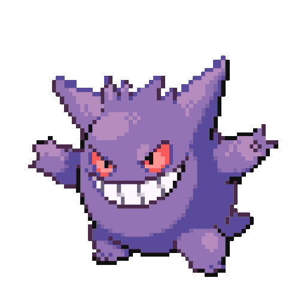
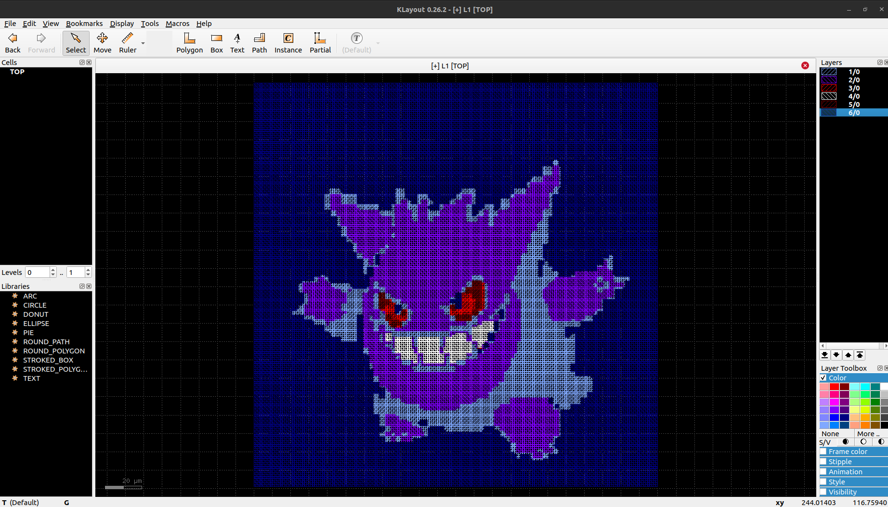

# An attempt at rendering pixel art in KLayout.

Created a Python script, extract_map.py, that maps the colors extracted from a PNG image.

---------------------------------------------------------------

The closest color is picked based on the distance from the predefined list of colors (the palette I am interested in).
mapped_output/frame_0001.txt

---------------------------------------------------------------

In KLayout, I have created canvas.lym macro to render it (based on Mathias Koefferlein's training session - https://www.youtube.com/watch?v=DFqGkG12DtU ).
Added a custom layer definition that adds 6 layers as I have 6 layers in my color palette.

---------------------------------------------------------------

The read_img.lym places the box in the KLayout canvas based on the mapped_output/frame_0001.txt file.

